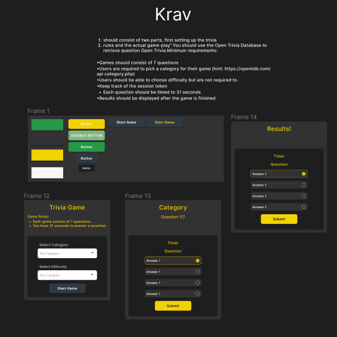

# Trivia App

Welcome to my trivia App!

## Features

- **Interactive UI**: Select categories and difficulty levels.
- **Dynamic Questions**: Displays a set of questions based on user choices.
- **Results**: Shows correct and incorrect answers after completion.
- **Replayability**: Allows users to play again.
- **Tech Stack**: Built with React, Redux, Styled Components, and TypeScript.
- **Figma**: Was used to design the app.
  

## Demo

If you don't wish to set up the project locally, you can try out the deployed version on Netlify:
PS: If you chose the Netlify version there is a small bugg at the moment, where the first time u enter the page u have to choose categories twice.
[Trivia App Live Demo](https://internship-trivia.netlify.app/)

## Getting Started

- Node.js and npm installed on your machine.

### Setup

1. **Clone the repository**:
   ```bash
   git clone https://github.com/RevanToma/trivia.git
   cd trivia
   npm install
   npm start
   ```
